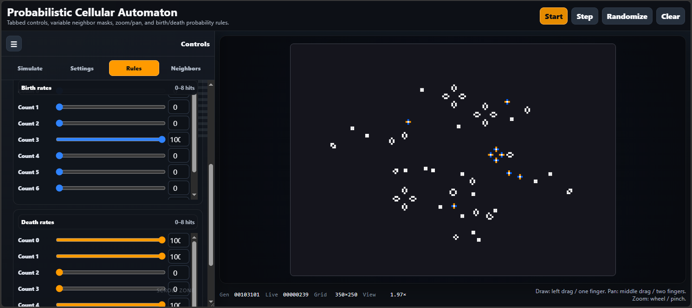

# Probabilistic Cellular Automaton
Using Conway's game of life as a base, I've vibe-coded together some controls which modify a handful of parameters to play and tune alternative configurations for the simulation.

